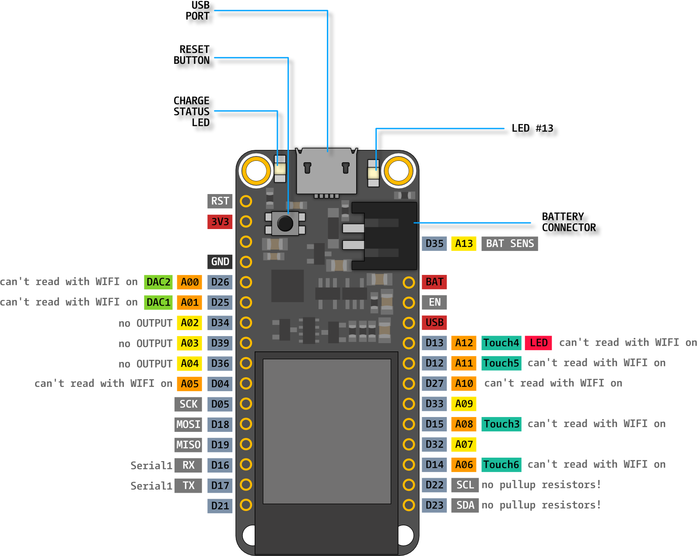

# Bird@Edge Mic

Bird@Edge Mic is an audio streaming appliance based on an ESP32 and an I2S microphone intended for soundscape recordings of birds.


## Bird Song Recognition at the Edge

Bird@Edge is an Edge AI system for recognizing bird species in audio recordings to support real-time biodiversity monitoring. Bird@Edge is based on embedded edge devices operating in a distributed system to enable efficient, continuous evaluation of soundscapes recorded in forests. If you are interested in our research, [read our paper](https://jonashoechst.de/assets/papers/hoechst2022birdedge.pdf) or watch the talk recorded for [Springer NETYS 2022 conference](https://www.youtube.com/watch?v=reAm4HSyQl8). 

Separate repositories exist for the [machine learning approach](https://github.com/umr-ds/BirdEdge) and for the operating system image [Bird@Edge OS](https://github.com/umr-ds/BirdEdge-OS) created for running on the Bird@Edge Stations.

## Functionality

An integrated web-server offers a (single) WAV-stream consisting of the data comming directly read from the microphone. The WAV header is constructed according to the configuration used for i2s.  

> Note: The stream can only be accessed by a single HTTP client, as there is no buffering, etc. involved. 

## Hardware

First, the i2s microphone needs to be connected according to the pinout definition in the code: 

```c
const i2s_pin_config_t pin_config = {
    .bck_io_num = 14,   // BCKL
    .ws_io_num = 15,    // LRCL
    .data_out_num = -1, // not used (only for speakers)
    .data_in_num = 32   // DOUT
};
```

An examplary board which can be used in the project is the Adafruit HUZZAH32 Feather, its pinout is presented here:




## Building & Flashing

The project can be built and flashed using the [PlatformIO](https://platformio.org/install/cli) toolchain.

```c
$ pio run -t upload      
Processing esp32dev (platform: espressif32; board: esp32dev; framework: arduino)
-----------------------------------------------------------------------------------------------------------------------------------------------
Verbose mode can be enabled via `-v, --verbose` option
CONFIGURATION: https://docs.platformio.org/page/boards/espressif32/esp32dev.html
PLATFORM: Espressif 32 (3.5.0) > Espressif ESP32 Dev Module
HARDWARE: ESP32 240MHz, 320KB RAM, 4MB Flash
DEBUG: Current (esp-prog) External (esp-prog, iot-bus-jtag, jlink, minimodule, olimex-arm-usb-ocd, olimex-arm-usb-ocd-h, olimex-arm-usb-tiny-h, olimex-jtag-tiny, tumpa)
PACKAGES: 
 - framework-arduinoespressif32 3.10006.210326 (1.0.6) 
 - tool-esptoolpy 1.30100.210531 (3.1.0) 
 - tool-mkspiffs 2.230.0 (2.30) 
 - toolchain-xtensa32 2.50200.97 (5.2.0)
LDF: Library Dependency Finder -> https://bit.ly/configure-pio-ldf
LDF Modes: Finder ~ chain, Compatibility ~ soft
Found 28 compatible libraries
Scanning dependencies...
Dependency Graph
|-- <WiFi> 1.0
Building in release mode
Compiling .pio/build/esp32dev/src/main.cpp.o
Generating partitions .pio/build/esp32dev/partitions.bin

```


## Scientific Usage & Citation

If you are using Bird@Edge in academia, we'd appreciate if you cited our [scientific research paper](https://jonashoechst.de/assets/papers/hoechst2022birdedge.pdf). Please cite as "Höchst & Bellafkir et al."

> J. Höchst, H. Bellafkir, P. Lampe, M. Vogelbacher, M. Mühling, D. Schneider, K. Lindner, S. Rösner, D. G. Schabo, N. Farwig, and B. Freisleben, "Bird@Edge: Bird Species Recognition at the Edge," in *International Conference on Networked Systems (NETYS)*, 2022. DOI: [10.1007/978-3-031-17436-0_6](https://dx.doi.org/10.1007/978-3-031-17436-0_6)

```bibtex
@inproceedings{hoechst2022birdedge,
  title = {{Bird@Edge: Bird Species Recognition at the Edge}},
  author = {H{\"o}chst, Jonas and Bellafkir, Hicham and Lampe, Patrick and Vogelbacher, Markus and M{\"u}hling, Markus and Schneider, Daniel and Lindner, Kim and R{\"o}sner, Sascha and Schabo, Dana G. and Farwig, Nina and Freisleben, Bernd},
  booktitle = {International Conference on Networked Systems (NETYS)},
  year = {2022},
  month = may,
  organization = {Springer},
  keywords = {Bird Species Recognition, Edge Computing, Passive Acoustic Monitoring, Biodiversity},
  doi = {10.1007/978-3-031-17436-0_6},
}
```